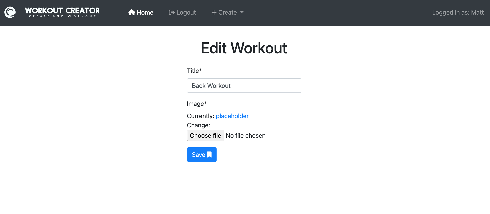
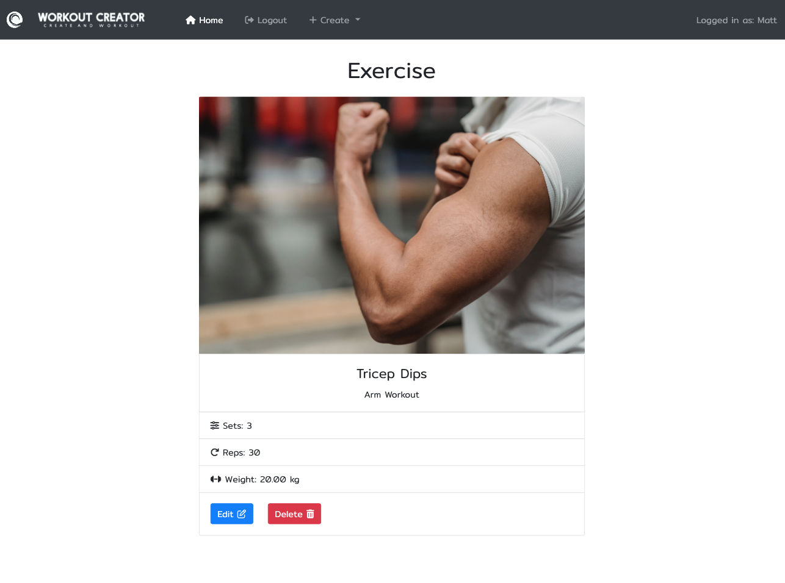

# Workout Creator

<a href="https://create-workout-app.herokuapp.com">Workout Creator</a> is an application that demonstrates basic use of the web framework <a href="https://www.djangoproject.com/">django</a>. The app is targeted for people who enjoy working out, keeping fit and want to keep track of their workouts. The app allows users to create, read, update and delete exercises, as well as creating their own account. The app is fully responsive on most handheld and desktop devices.

 

## Features

### Creating Exercises:
<ul>
  <li>One of the main features, for this app, is the ability to create an exercise post. The user is presented with a form, in which they fill out with their exercise details and click 'Add Exercise' button or 'ENTER' key. The created exercise post is immediately added to the homepage (index.html).</li>
</ul>
 

 

### Creating Workout Categories:
<ul>
  <li>Another feature is the ability to create a workout category. Theses categories organise created exercises into 'workout groups'. The user also has the choice to add a featured image to their categories. This seperates the users workouts, visually. If no image is chosen a placeholder will take it's place.</li>
</ul>
 

 

### Editing Exercises:
<ul>
  <li>Once the user has created an exercise post, they have the ability to edit them. Each created exercise card displayed on the homepage (index.html) is presented with two buttons, one of them being the 'Edit Exercise' button. This takes the user to a editing autofilled form with existing exercise post values. Here, the user can alter their exercise post.</li>
 <li>There is also another 'Edit' button displayed within the exercise detail page.(as seen below)</li>
</ul>
 

 

### Editing Workout Categories:
<ul>
  <li>As well as editing exercises, the user can also edit their created workout categories. The second button on the exercise card, presented on the homepage, is the 'Edit Workout' button. This also leads the user to a seperate editing form with the form autofilled with the category values.</li>
</ul>
 

 

### Viewing Exercises:
<ul>
  <li>When the user has created an exercise, they can view them on a seperate page with details of their workout plan.</li> 
  <li>They can acheive this by simply clicking on the card title on the desired exercise card on the homepage.</li>
</ul>
 

 

### Deleting Exercises:
<ul>
  <li>As well as creating and editing exercises, the user can also remove desired exercise posts.</li>
  <li>When viewing exercises, at the bottom of the exercise card are two buttons, 'Edit' and 'Delete'. Selecting to delete an exercise takes the user to a delete confirmation page, where the user can confirm whether to permanently delete the desired exercise post or not.</li>
</ul>
 

 

### Creating Account / Signing In:
<ul>
  <li>To access the site, the user must sign up, create an account. Once signed up the user has permission to begin creating exercises.</li>
  <li>If the user has already registered, they must sign in to gain access to these features.</li>
</ul>
 

Sign Up page:

 

Login page, This welcomes all users who visit the app:

## Other Features

### Branding:
<ul>
<li>A logo and banner is provided to make the app look more efficient.</li>
</ul>

## Testing

### Device Testing:
<ul>
  <li>Tested the application on several different devices, such as iPhone (11, SE), iPad air and Google nest hub (2nd gen).</li>
  <li>No bugs or errors returned when testing on these devices.</li>
</ul>

### Browser Testing:
<ul>
  <li>No bugs or errors occurred when testing on the following browsers:</li>
  <ul>
    <li>Google Chrome</li>
    <li>Firefox</li>
    <li>Safari</li>
  </ul>
</ul>

### Bugs & Errors:

When operating through the app, I came across a series of bugs, these included:

<ul>
  <li>Creating Workout Bug:</li>
  <ul>
  <li>When completing the create workout category form an error occurs. This is caused by the slug field not being prepopulated with the title value of the created workout category.</li>
    <li>The user is shown an error page instead of being redirected back to the homepage.</li>
  </ul>
   
  <li>Featured Images Not Saving:</li>
  <ul>
  <li>Another bug involving creating a workout category.</li>
  <li>When adding or editing a workout category and applying a featured image, the chosen image is not saved and displays the placeholder instead.</li>
  <li>This may be down to not saving to Cloudinary database.</li>
  </ul>
</ul>

## Features For The Future

