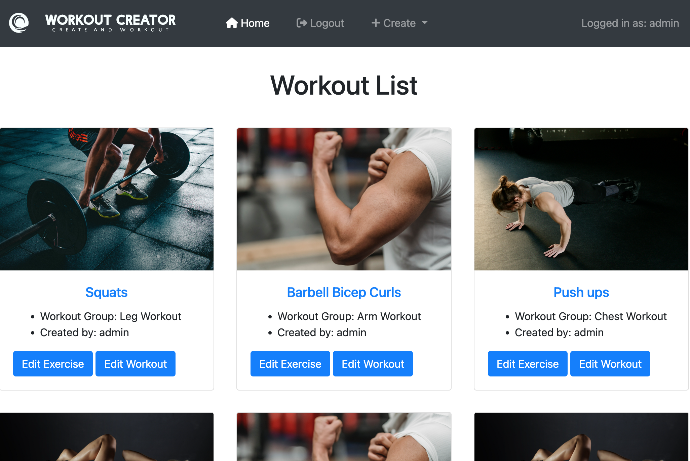
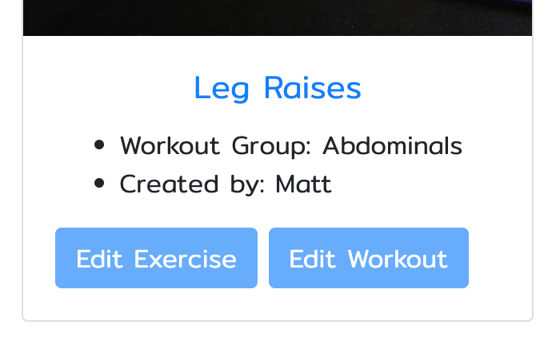

# Workout Creator

<a href="https://create-workout-app.herokuapp.com">Workout Creator</a> is an application that demonstrates basic use of the web framework <a href="https://www.djangoproject.com/">django</a>. The app is targeted for people who enjoy working out, keeping fit and want to keep track of their workouts. The app allows users to create, read, update, delete and share exercises, as well as creating their own account. The app is fully responsive on most handheld and desktop devices.

 

## Features

### Creating Exercises:
<ul>
  <li>One of the main features, for this app, is the ability to create an exercise post. The user is presented with a form, in which they fill out with their exercise details and click 'Add Exercise' button or 'ENTER' key. The created exercise post is immediately added to the homepage (index.html).</li>
  <li>User is informed, below the form, to create a workout before adding exercises if they want to add the created exercise to a new category or if no workouts exist.</li>
</ul>
 

 

### Creating Workout Categories:
<ul>
  <li>Another feature is the ability to create a workout category. Theses categories organise created exercises into 'workout groups'. The user also has the choice to add a featured image to their categories. This seperates the users workouts, visually. If no image is chosen a placeholder will take it's place.</li>
</ul>
 

 

### Editing Exercises:
<ul>
  <li>Once the user has created an exercise post, they have the ability to edit them. Each created exercise card displayed on the homepage (index.html) is presented with two buttons, one of them being the 'Edit Exercise' button. This takes the user to a editing autofilled form with existing exercise post values. Here, the user can alter their exercise post.</li>
 <li>There is also another 'Edit' button displayed within the exercise detail page.(as seen below)</li>
</ul>
 

 

### Editing Workout Categories:
<ul>
  <li>As well as editing exercises, the user can also edit their created workout categories. The second button on the exercise card, presented on the homepage, is the 'Edit Workout' button. This also leads the user to a seperate editing form with the form autofilled with the category values.</li>
</ul>
 

 

### Viewing Exercises:
<ul>
  <li>When the user has created an exercise, they can view them on a seperate page with details of their workout plan.</li> 
  <li>They can acheive this by simply clicking on the card title on the desired exercise card on the homepage.</li>
</ul>
 

 

### Deleting Exercises:
<ul>
  <li>As well as creating and editing exercises, the user can also remove desired exercise posts.</li>
  <li>When viewing exercises, at the bottom of the exercise card are two buttons, 'Edit' and 'Delete'. Selecting to delete an exercise takes the user to a delete confirmation page, where the user can confirm whether to permanently delete the desired exercise post or not.</li>
</ul>
 

 

### Creating Account / Signing In:
<ul>
  <li>To access the site, the user must sign up, create an account. Once signed up the user has permission to begin creating exercises.</li>
  <li>If the user has already registered, they must sign in to gain access to these features.</li>
</ul>
 

Sign Up page:

 

Login page, This welcomes all users who visit the app:

## Other Features

### Branding:
<ul>
<li>A logo and banner is provided to make the app look more efficient.</li>
</ul>

### Navbar Features:
<ul>
  <li>Responsive nav. When operating the site on a small device, the nav condenses down to a 'burger' menu.</li>
  <li>Contains a dropdown menu for selecting what to create.</li>
  <li>Also, when logged in, username is displayed within the navbar.</li>
</ul>

### User Authorisation:
<ul>
  <li>When users create an exercise, they become the publisher of that exercise and are able to edit those exercises. If they are not the creator, publisher, of a group of exercises they cannot edit or delete those exercises. The edit buttons are disabled.</li>
</ul>

User authorised to edit exercise:

 

User unauthorised to edit exercise:

(Buttons disabled)

### Messages:
<ul>
  <li>Added meassages to indicate a successful operation.</li>
</ul>
(Successful sign in message.)

## Features For The Future

### Create Workout Plan/List:
<ul>
<li>A feature where the user can view exercises from the same workout category in a list. Creating a workout plan.</li>
<li>Add comments/likes to exercises/workout plans.</li>
<li>Correct featured image bug, so user can use their own image for their exercise/workouts, instead of the placeholder.</li>
</ul>

## Testing

### Device Testing:
<ul>
  <li>Tested the application on several different devices, such as iPhone (11, SE), iPad air and Google nest hub (2nd gen).</li>
  <li>No bugs or errors returned when testing on these devices.</li>
</ul>

### Browser Testing:
<ul>
  <li>No bugs or errors occurred when testing on the following browsers:</li>
  <ul>
    <li>Google Chrome</li>
    <li>Firefox</li>
    <li>Safari</li>
  </ul>
</ul>

### Bugs & Errors:

When operating through the app, I came across a series of bugs, these included:

<ul>
  <li>Creating Workout Slugfield Bug:</li>
  <ul>
    <li>When completing the create workout category form an error occurs. This is caused by the slug field not being prepopulated with the title value of the created workout category.</li>
    <li>The user is shown an error page instead of being redirected back to the homepage.</li>
    <li>Had to visit the admin site to manually update the slug for each workout category.</li>
  </ul>
   
  <li>Featured Images Not Saving:</li>
   <ul>
    <li>Another bug involving creating a workout category.</li>
    <li>When adding or editing a workout category and applying a featured image, the chosen image is not saved and displays the placeholder instead.</li>
    <li>This may be down to not saving to Cloudinary database.</li>
     <li>Had to access admin site to change featured image.</li>
  </ul>
   
  <li>Deleting workout category removes other users exercises:</li>
  <ul>
    <li>I originally had a delete workout category feature, but I discovered that when I deleted a category it removed exercises that were not created by the user deleting the category.</li>
  </ul>
    <li>Google Font not present:</li>
  <ul>
    <li>I imported a google font in the style.css file, 'Mitr'. Unfortunately during testing this font does not work on any browsers, displays sans-serif as a backup.</li>
  </ul>
</ul>

## User Experience (UX)

### Design:
<ul>
  <li>Colour Scheme:</li>
  <ul>
    <li>There is not alot of colour present but that's what makes it effective. With a white background and a dark grey navbar, this allows created exercise posts stand out along with the blue buttons,links and featured images.</li>
  </ul>
    <li>Navigation:</li>
  <ul>
    <li>The navigation is very modern and efficient. There's very little content within the nav, this makes it easy for the user to navigate round the site.</li>
  </ul>
    <li>Icons:</li>
  <ul>
    <li>There are many icons on the app. Icons indicate what the content consists of and/or what it carries out (ex.trash bin indicates deletion).</li>
  </ul>
</ul>

## Technologies Used:

### Languages Used:
<ul>
  <li><a href="https://en.wikipedia.org/wiki/HTML5">HTML5</a></li>
  <li><a href="https://en.wikipedia.org/wiki/CSS">CSS3</a></li>
  <li><a href="https://en.wikipedia.org/wiki/JavaScript">Javascript</a></li>
</ul>

### Frameworks, Libraries and Programs Used:
<ul>
  <li><a href="https://fonts.google.com/">Google Fonts</a></li>
  <ul>
    <li>Google fonts was used to import the 'Mitr' font into the style.css file.</li>
  </ul>
    <li><a href="https://fontawesome.com/">FontAwesome</a></li>
  <ul>
    <li>Fontawesome was used to add icons to several elements.</li>
  </ul>
    <li><a href="https://git-scm.com/">Git</a></li>
  <ul>
    <li>Git was used for version control and using the Gitpod terminal to commit and push to GitHub.</li>
  </ul>
  <li><a href="https://github.com/">GitHub</a></li>
    <ul>
    <li>GitHub is used to store the projects code after being pushed from Git.</li>
  </ul>
  <li><a href="https://www.pixelmator.com/pro/">Pixelmator</a></li>
  <ul>
    <li>I used Pixelmator to edit logo and banner.</li>
  </ul>
  <li><a href="https://getbootstrap.com/docs/4.3/getting-started/introduction/">Bootstrap4</a></li>
  <ul>
    <li>Bootstrap framework is used for styling, structuring and reponsive development</li>
  </ul>
    <li><a href="https://www.djangoproject.com/">Django</a></li>
  <ul>
    <li>Django framework was used to create the app/project.</li>
  </ul>
</ul>

## Credits:

### Code:
<ul>
  <li>I occasionally referenced to <a href="https://stackoverflow.com/">stackoverflow</a> for guidance.</li>
  <li>I also used this Django project as a reference: <a href="https://www.notimedad.dev/django-small-project-workout-tracker/">NoTimeDad</a></li>
</ul>

### Media:
<ul>
  <li>The logo and branding was from <a href="https://smashinglogo.com/en/">smashinglogo</a>.</li>
  <li>The placeholder image used for featured image field for when creating a new workout category was from <a href="https://unsplash.com/">unsplash</a>.</li>
  <li>Featured images for already created exercises are from <a href="https://www.pexels.com/">Pexels</a>.</li>
</ul>
